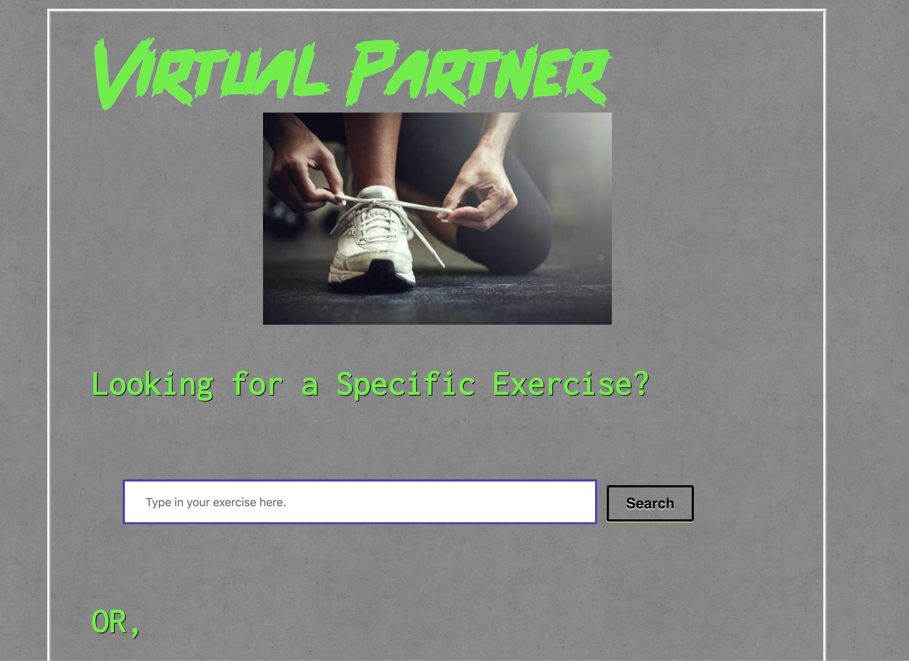
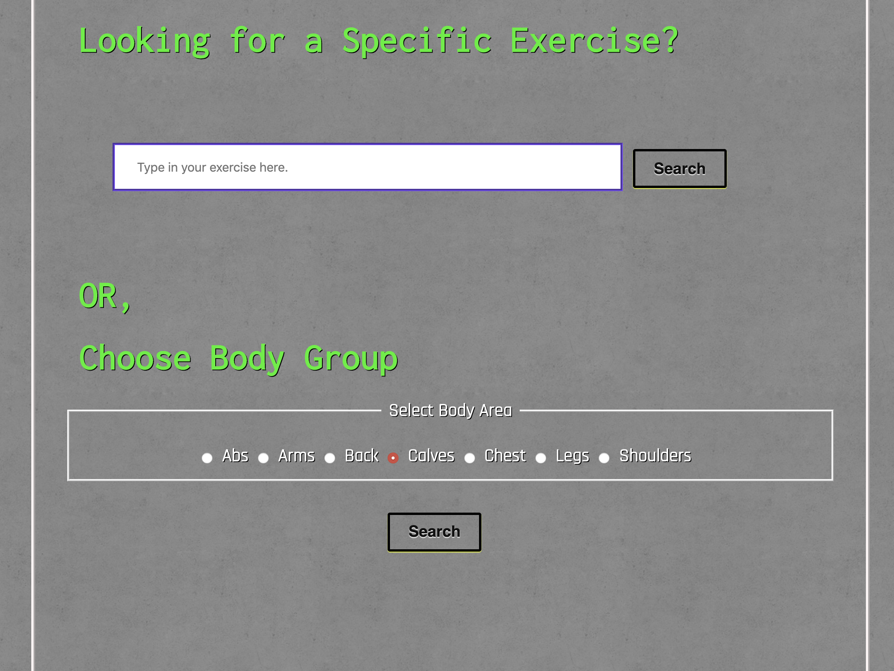
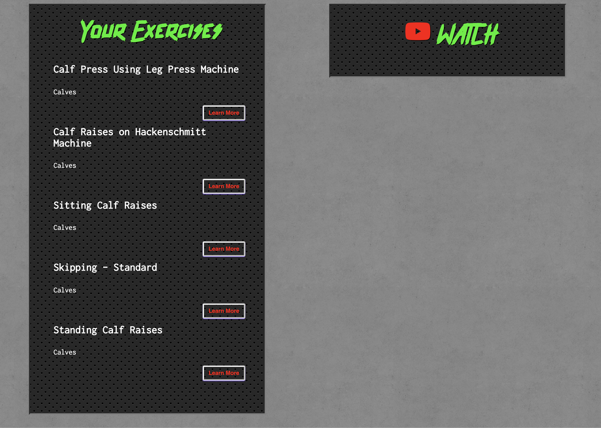
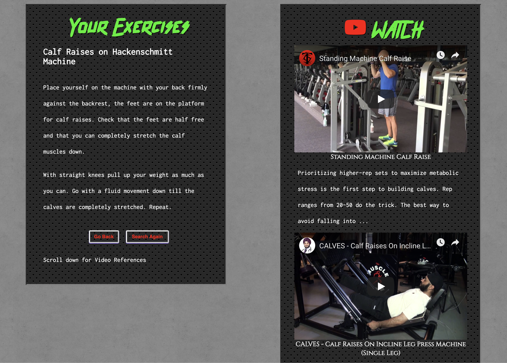

# workout-partner
 
 Summary:

 I created this app to give users the ability to look up exercises for their workout. It allows them to search for a specific exercise, if they know what they want, or for a body group.  In either option, they are provided with a description and three youtube videos to further their understanding of the exercise of choice. 
 
 The API comes from both "youtube" and "wger REST API" for the exercises. The user is given all the exercises in the data base that are in english and the group, that runs "wger REST API", deems is complete in their format. It is my belief that for someone looking for a quick look up on the go they app provides it for them.

 Live Link:

 [workout-partner](https://thorn086.github.io/workout-partner/) 

 Screen Shots:

 
 
 
 

 Tech Used:
 
 HTML/CSS/JavaScript/jQuery
